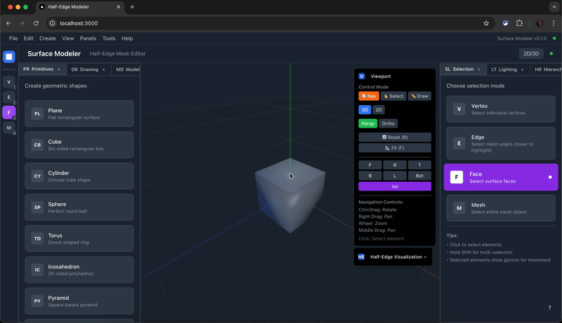
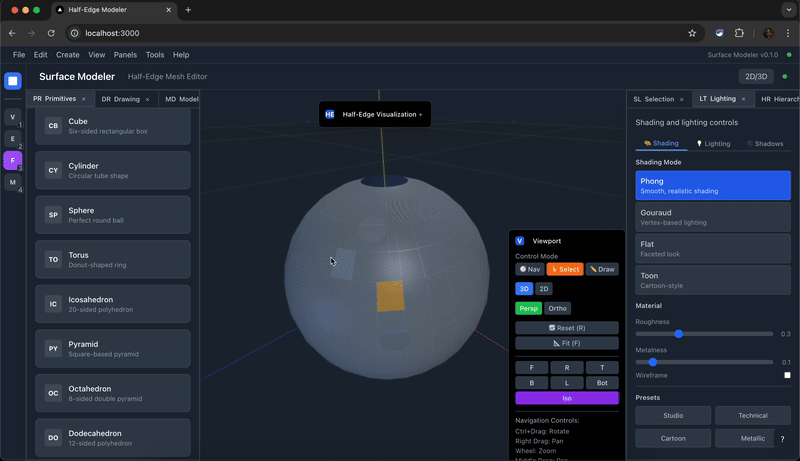
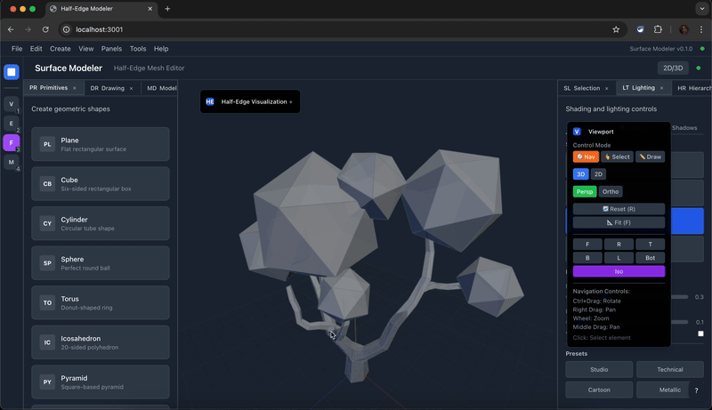
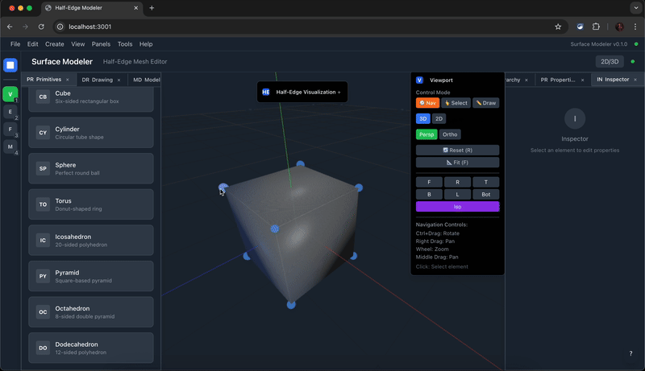
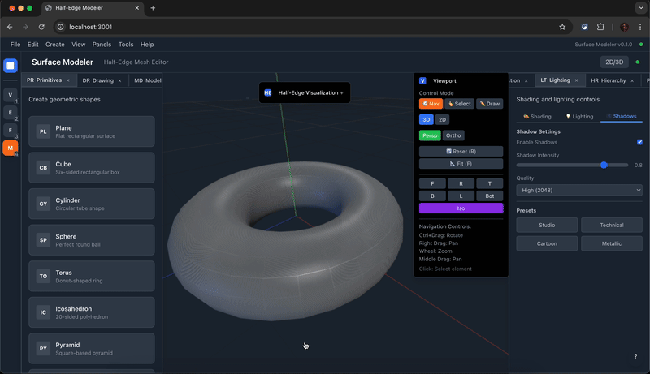
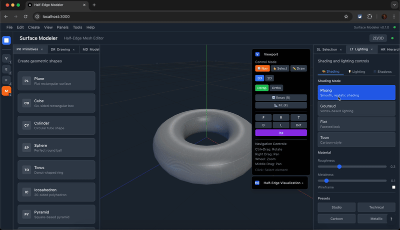

# Half-Edge Surface Modeler

A modern 3D surface modeling web application built with TypeScript, featuring a separated kernel architecture for high-performance mesh operations. Built with Unity ProBuilder-inspired interface and professional 3D modeling tools.

## Demo

### Interactive Gizmo Manipulation


### Face Selection


### OBJ File Import


### Inspector Panel


### Lighting Presets


### Shading Modes


## Features

### Core Architecture
- **Separated Kernel Architecture**: Pure TypeScript geometry kernel independent of UI
- **Half-Edge Mesh Data Structure**: Robust mesh representation supporting complex operations
- **Command Pattern**: Full undo/redo support for all modeling operations
- **Modern Stack**: React + Three.js + Tailwind CSS + Zustand
- **Extensible Design**: Easy to add new modeling operations and file importers

### Selection & Interaction
- **Vertex, Edge, Face Selection**: Unity ProBuilder-style gizmos with hover and selection states
- **Vertex, Edge, Face Movement**: Interactive dragging with screen-space scaled gizmos
- **Professional Gizmos**: Fixed-size selection indicators that don't scale with camera zoom
- **Multi-mode Selection**: Switch between vertex, edge, face, and mesh selection modes

### Visualization & Rendering
- **Real-time 3D Viewport**: Interactive Three.js-powered 3D scene
- **Camera Controls**: Smooth zoom, pan, and rotate with mouse/trackpad
- **Lighting & Shading**: Multiple lighting presets and shading modes
- **2D/3D Views**: Toggle between perspective and orthographic projections
- **Material System**: PBR materials with customizable properties

### Inspector & UI
- **Inspector Panel**: View and edit mesh properties, selection info, and object hierarchy
- **Property Editing**: Real-time modification of vertex positions, face normals, and material properties
- **Selection Statistics**: Display counts and details of selected elements
- **Responsive Interface**: Clean, professional UI that scales across devices

### File Import/Export
- **OBJ Import**: Load .obj files with full geometry conversion to half-edge structure
- **Multiple Format Support**: GLTF, GLB format support for modern 3D workflows
- **Robust Conversion**: Safe mesh conversion with validation and error handling
- **File Menu Integration**: Seamless import/export through standard menu interface

## Quick Start

```bash
# Install dependencies
pnpm install

# Build the kernel package
pnpm --filter @half-edge/kernel build

# Run demo to verify everything works
node demo.mjs

# Start development server
pnpm dev

# Run tests
pnpm test

# Build for production
pnpm build
```

Navigate to `http://localhost:3001` to see the application (port may vary if 3001 is in use).

## Project Structure

```
/
├── packages/
│   └── kernel/           # Core geometry and modeling kernel
│       ├── src/
│       │   ├── types.ts      # Type definitions
│       │   ├── mesh.ts       # Half-edge mesh implementation
│       │   ├── command.ts    # Command pattern and history
│       │   ├── operations.ts # Modeling operations
│       │   ├── primitives.ts # Primitive creation
│       │   └── utils.ts      # Utility functions
│       └── tests/        # Unit tests
└── apps/
    └── web/              # React web application
        ├── src/
        │   ├── components/   # React components
        │   ├── hooks/        # Custom hooks
        │   ├── services/     # API adapters
        │   └── store.ts      # Global state management
        └── public/
```

## Usage

### Basic Operations

1. **Create Primitives**: Use the toolbar to create planes, cubes, or cylinders
2. **Selection Modes**: Switch between vertex, edge, face, and mesh selection modes
3. **Interactive Selection**: Click vertices, edges, or faces to select them (highlighted with gizmos)
4. **Gizmo Manipulation**: Drag the Unity ProBuilder-style gizmos to move selected elements
5. **File Import**: Use File → Import to load OBJ, GLTF, or GLB files
6. **Inspector View**: Monitor selection details and edit properties in the inspector panel
7. **Lighting Control**: Adjust lighting presets and shading modes for optimal visualization
8. **Extrude**: Press `E` or use the toolbar button to extrude selected faces
9. **Flip Normals**: Use the flip normals button to reverse face orientation
10. **Undo/Redo**: Press `Ctrl+Z`/`Ctrl+Shift+Z` or use toolbar buttons

### Hotkeys

- `E` - Extrude selected face
- `Space` - Toggle 2D/3D view
- `Ctrl+Z` - Undo
- `Ctrl+Shift+Z` - Redo
- `1` - Vertex selection mode
- `2` - Edge selection mode  
- `3` - Face selection mode
- `4` - Mesh selection mode

### View Controls

- **Camera Movement**: Mouse drag to rotate, scroll to zoom, middle-click to pan
- **Selection Modes**: Click to select elements, drag gizmos to move them
- **View Modes**: Toggle between 2D orthographic and 3D perspective views
- **Visual Feedback**: Selected elements are highlighted with professional gizmos
- **Inspector Integration**: View selection details and properties in real-time

## Architecture

### Kernel Package (`@half-edge/kernel`)

The kernel is a pure TypeScript library that handles all geometry and modeling operations:

- **Mesh Representation**: Half-edge data structure for efficient mesh operations
- **Command System**: All operations are commands with do/undo methods
- **Type Safety**: Full TypeScript coverage with strict typing
- **Platform Agnostic**: No DOM dependencies, can run in Node.js or WebWorkers

### Web Application (`@half-edge/web`)

React-based frontend that provides the user interface:

- **Three.js Integration**: Real-time 3D rendering and interaction
- **State Management**: Zustand for global application state
- **Component Architecture**: Modular React components
- **Responsive Design**: Tailwind CSS for styling

## Development

### Adding New Operations

1. Create a new command class extending `BaseCommand`:

```typescript
export class MyOperationCommand extends BaseCommand {
  constructor(private param: string) {
    super('my_operation');
  }

  do(mesh: Mesh): void {
    // Implement operation
  }

  undo(mesh: Mesh): void {
    // Implement undo
  }
}
```

2. Add UI controls in the toolbar component
3. Add keyboard shortcuts in the `useKeyboard` hook

### Adding File Import Support

1. Implement the `MeshImporter` interface:

```typescript
export class GLTFImporter implements MeshImporter {
  async import(buffer: ArrayBuffer): Promise<Mesh> {
    // Use Three.js loaders to parse format
    // Convert to kernel mesh representation
  }
}
```

2. Register the importer in the web application
3. Add UI for file selection and import

### Testing

Run the test suite:

```bash
# All tests
pnpm test

# Kernel tests only
pnpm --filter @half-edge/kernel test

# Watch mode
pnpm --filter @half-edge/kernel test:watch
```

## Performance Considerations

- Heavy operations can be moved to WebWorkers using the provided adapter pattern
- Mesh operations use efficient half-edge traversal algorithms
- Command history implements snapshot checkpoints for large operations
- Three.js rendering is optimized with geometry buffers and material batching

## Future Extensions

The architecture supports several planned extensions:

- **WebWorker Support**: Move heavy mesh operations to background threads
- **WASM Integration**: Compile performance-critical operations to WebAssembly
- **File Format Support**: Import/export OBJ, GLTF, GLB and other 3D formats ✅
- **Advanced Operations**: Boolean operations, subdivision surfaces, sculpting tools
- **Collaboration**: Multi-user editing with operational transforms

## License

MIT License - see LICENSE file for details.